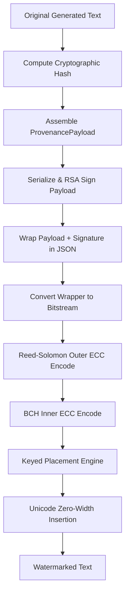
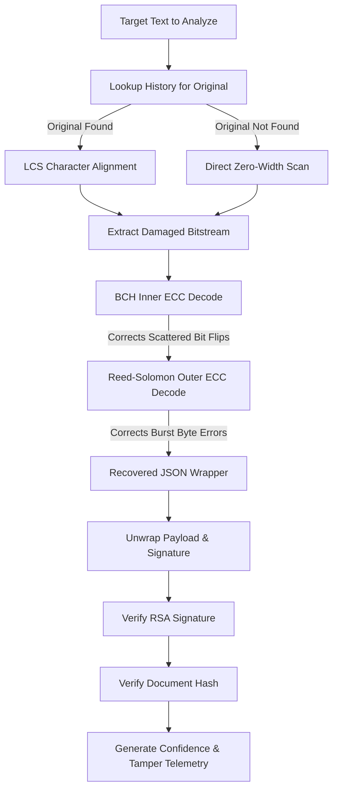

# ZeroTrace: Cryptographic Text Watermarking & Tamper Telemetry Engine

ZeroTrace is a state-of-the-art, robust, and invisible text-watermarking system designed to track the provenance of AI-generated content and detect downstream text tampering. By combining zero-width steganography with advanced cryptographic signing and concatenated error-correcting codes, ZeroTrace provides cryptographically verifiable proof of origin and detailed tamper diagnostics (telemetry) even after text has been edited, paraphrased, or partially deleted.

---

## Key Features

- **Cryptographic Provenance**: Signs generated content using asymmetric key cryptography (RSA-2048). The signature is embedded directly within the text, making it non-forgeable and verifiable using a public key.
- **Concatenated Error-Correcting Codes (ECC)**: Implements an industry-standard concatenated channel code (`BCH` + `Reed-Solomon`) to protect the watermark payload against edits:
  - **Inner Code (BCH)**: Detects and repairs scattered, individual bit errors (e.g., typos, word swaps).
  - **Outer Code (Reed-Solomon)**: Corrects contiguous byte errors (e.g., deleting sentences, replacing paragraphs, or editing whole blocks).
- **Keyed Placement Engine**: Distributes the watermark bits pseudorandomly at word boundaries using an HMAC-SHA256 generator keyed with a server secret key, document hash, and random nonce. This prevents attackers from easily locating, harvesting, or cleaning the invisible bits.
- **Invisible Steganography**: Translates binary watermark data to zero-width Unicode characters (`\u200B` for `0` and `\u200C` for `1`), hiding the payload completely from human eyes while maintaining standard copy-paste functionality.
- **Alignment-based Recovery (LCS)**: Uses character-level Longest Common Subsequence (LCS) alignment to align modified text against the original generated copy, allowing recovery of watermark bits even from heavily altered or truncated versions.
- **Autonomous Search Agent**: Exposes a web interface powered by Vercel AI SDK, Mistral AI, and Tavily Search to generate real-time verified facts and automatically watermark them.

---

## System Architecture

### 1. Watermark Encoding & Embedding Pipeline


### 2. Watermark Extraction, Decoding, & Telemetry Pipeline


---

## Detailed Architectural Deep-Dive & Key Concepts

ZeroTrace is not a simple steganographic tool; it is a communication system modeled on channel coding and cryptographic authenticity. Below is a comprehensive explanation of the concepts, mathematics, and terms that govern its architecture.

### 1. Provenance Metadata & Document Binding
At the heart of the system is the **Provenance Payload**, a structured JSON record that holds:
*   `version`: The schema version identifier.
*   `provider`: The organization/system hosting the generator (e.g., `zerotrace-web`).
*   `modelId`: The model name used to create the text (e.g., `mistral-small-latest`).
*   `timestamp`: An ISO 8601 timestamp logging generation time.
*   `nonce`: A cryptographically secure random string ensuring unique outputs.
*   `documentHash`: A SHA-256 hash of the *clean, unwatermarked* document.

**Why Document Binding Matters**:
Without the `documentHash`, an attacker could copy the invisible characters from an official, verified AI document and paste them into a malicious document. This is known as a **provenance transfer attack**. By signing and embedding the hash of the *original* text inside the watermark, the detector can verify if the watermark payload belongs to the text it is currently reading. If the hashes do not match, the signature verification fails, exposing the transfer attempt.

### 2. Cryptographic Integrity (RSA-2048 & SHA-256)
ZeroTrace uses asymmetric cryptography to ensure **non-repudiation** and **tamper detection**:
*   **Asymmetric Signing**: The backend signs the serialized payload using a private RSA key. The generated signature is combined with the payload inside a JSON wrapper.
*   **Public Key Verification**: Anyone with access to the public key can verify that the payload was generated by the holder of the private key and has not been altered.
*   **SHA-256 hashing**: Provides pre-image resistance, ensuring that even minor edits in the text result in a completely different hash, breaking the signature verification.

### 3. Galois Field $GF(2^8)$ Arithmetic
Standard mathematics (like addition and multiplication) do not apply directly to error-correcting codes because operations can result in values that exceed the block size (e.g., multiplying bytes can result in numbers larger than 255). 
To solve this, ZeroTrace uses **Galois Field arithmetic** over $GF(2^8)$:
*   **Addition and Subtraction**: Done via bitwise XOR operations (e.g., $12 \oplus 9 = 5$).
*   **Multiplication and Division**: Handled using a primitive generator polynomial $p(x) = x^8 + x^4 + x^3 + x^2 + 1$ (value `0x11D` or 285). ZeroTrace precomputes Logarithmic and Antilogarithmic (Exponential) tables to convert multiplication into addition of exponents, allowing fast, constant-time operations.

### 4. Reed-Solomon Code (Outer ECC)
The outer layer of ZeroTrace's error correction is a **Reed-Solomon (RS)** code, which is a non-binary cyclic code:
*   **Symbol-Oriented**: Instead of operating on individual bits, RS operates on multi-bit symbols. ZeroTrace uses 8-bit symbols (bytes).
*   **Burst Error Correction**: Because it is symbol-oriented, a burst of bit errors affecting a single byte only counts as *one* symbol error. If an attacker deletes a full sentence, this wipes out a contiguous run of characters. Reed-Solomon sees this as a sequence of corrupted bytes and can easily repair it.
*   **Parity and Capability**: Parameterized by parity size (default: 16 bytes). A code with $2t$ parity symbols can correct up to $t$ corrupted symbols. In our configuration, we can repair up to 8 bad bytes per block.

### 5. BCH Code (Bose-Chaudhuri-Hocquenghem) (Inner ECC)
The inner layer is a **BCH** code, which is a binary cyclic code:
*   **Bit-Oriented**: BCH operates directly on the raw bitstream.
*   **Scattered Noise Correction**: While Reed-Solomon corrects block/burst edits, BCH is designed to correct independent, scattered bit flips. This includes typographical corrections, minor punctuation changes, or isolated character edits.
*   **Syndrome Decoding**: The decoder calculates syndromes over $GF(2^m)$ using an error locator polynomial (solved via the Berlekamp-Massey algorithm) to find the exact bit positions that were flipped and invert them.

### 6. Concatenated Coding Synergy
First introduced by Dave Forney in 1966, **concatenated coding** nests two different codes:
$$\text{Data} \xrightarrow{\text{Encode}} \text{Outer (Reed-Solomon)} \xrightarrow{\text{Encode}} \text{Inner (BCH)} \xrightarrow{\text{Embed}} \text{Channel (Text)}$$
*   **How they work together**: 
    1. During detection, the inner BCH code decodes the raw bitstream and fixes scattered, low-level bit flips.
    2. If a region of text was heavily modified, the BCH decoder in that block will exceed its error-correction threshold ($t=8$) and fail.
    3. The outer Reed-Solomon code receives these uncorrected blocks as symbol erasures. Since RS excels at correcting clustered symbol errors, it easily repairs the remaining blocks.
*   Together, they provide much stronger protection than either code alone, with lower overhead than simple repetition codes.

### 7. Keyed Placement Engine (HMAC-SHA256)
Inserting watermark characters at fixed intervals (like every 5th word) makes them trivial to locate, extract, or scrub. ZeroTrace prevents this through **keyed placement**:
*   The system extracts all word boundaries (spaces/word-breaks) in the document.
*   It initializes an HMAC-SHA256 generator using:
    1. A secret server-side key (`SECRET_KEY`).
    2. The document's clean hash.
    3. The payload nonce.
*   The HMAC generates a pseudorandom sequence of indexes. The watermark bits are inserted *only* at the boundaries corresponding to these indexes.
*   Without knowing the `SECRET_KEY`, an attacker cannot determine which word boundaries contain the zero-width characters and which are normal, making targeted scrubbing impossible.

### 8. Unicode Steganographic Channel
ZeroTrace hides bits in the text using invisible Unicode characters:
*   `0` bit $\rightarrow$ **Zero-Width Space** (`\u200B` / ZWSP).
*   `1` bit $\rightarrow$ **Zero-Width Non-Joiner** (`\u200C` / ZWNJ).
*   These characters have no visual glyph and occupy zero horizontal space in standard text renderers. However, they are fully valid Unicode symbols that are copied and pasted along with the visible characters.

### 9. Character-Level LCS Alignment
If a user edits the watermarked text (e.g., deletes a sentence or inserts a word), the positions of the invisible watermark characters shift. If we read them sequentially, the deleted bits would cause a **frame shift**, misaligning all subsequent bits and causing the ECC decoder to fail.

To solve this, ZeroTrace performs a **Longest Common Subsequence (LCS)** alignment:
*   It computes a character-level alignment matrix between the target text and the original watermarked text (retrieved from history).
*   The recurrence relation used to populate the dynamic programming table is:
    $$DP[i, j] = \begin{cases}
    DP[i-1, j-1] + 1 & \text{if } A[i-1] == B[j-1] \\
    \max(DP[i-1, j], DP[i, j-1]) & \text{otherwise}
    \end{cases}$$
*   By backtracking through the matrix, the detector determines exactly which characters in the original text (including the invisible watermark bytes) were kept, deleted, or inserted.
*   This aligns the extracted bitstream back to its original layout, converting deletion attacks into simple bit-erasures that the concatenated ECC code can easily correct.

### 10. Jaccard Similarity History Lookup
To align the target text, the detector must first find the corresponding original watermarked document. It does this by checking the server's history database:
*   It strips all invisible characters from the target text.
*   It computes the **Jaccard Similarity** against all historical documents:
    $$J(\text{Target}, \text{History}) = \frac{|\text{Words}_{\text{Target}} \cap \text{Words}_{\text{History}}|}{|\text{Words}_{\text{Target}} \cup \text{Words}_{\text{History}}|}$$
*   If the similarity is above the threshold (default: 30%), the server retrieves the matching history entry and uses its original text for LCS alignment.

### 11. Tamper Telemetry & Integrity Score
Instead of a binary "watermark present/absent" check, ZeroTrace outputs a graded **Integrity Score**:
*   **No Tampering**: $1.0$ (100% integrity) when no bit or byte corrections were required.
*   **Minor Tampering**: Score decreases proportionally to the number of BCH bits corrected and RS bytes corrected.
*   **Severe Tampering**: When any block is marked as `uncorrectable` by the ECC engine, the integrity score drops significantly, indicating that the text has been edited beyond the capacity of the error-correction channels.

---

## Directory Structure & Code Layout

ZeroTrace is organized into modular TypeScript packages under the `src` directory:

- [src/config.ts](file:///D:/pilabs/zerotrace/src/config.ts): Holds the secret key and paths for key persistence.
- [src/types/index.ts](file:///D:/pilabs/zerotrace/src/types/index.ts): Defines typing interfaces for the `ProvenancePayload`, `DetectionResult`, and `EccTamperStats`.
- **Core Watermarking Logic**:
  - [src/watermark/embedder.ts](file:///D:/pilabs/zerotrace/src/watermark/embedder.ts): Coordinates payload hashing, signing, ECC encoding, and bit embedding.
  - [src/watermark/placement.ts](file:///D:/pilabs/zerotrace/src/watermark/placement.ts): Implements the keyed placement algorithm based on HMAC-SHA256.
  - [src/detector/index.ts](file:///D:/pilabs/zerotrace/src/detector/index.ts): Implements watermark stripping, LCS alignment, and verification.
  - [src/unicode/index.ts](file:///D:/pilabs/zerotrace/src/unicode/index.ts): Encodes/decodes bits into `\u200B` (zero-width space) and `\u200C` (zero-width non-joiner).
  - [src/payload/bitstream.ts](file:///D:/pilabs/zerotrace/src/payload/bitstream.ts): Converts serialized JSON wrappers to raw bitstreams and vice versa.
- **Error-Correcting Codes (ECC)**:
  - [src/ecc/index.ts](file:///D:/pilabs/zerotrace/src/ecc/index.ts): Coordinates the concatenated RS + BCH encoding and decoding pipelines.
  - [src/ecc/reedSolomon.ts](file:///D:/pilabs/zerotrace/src/ecc/reedSolomon.ts): Byte-oriented outer code utilizing Galois Field GF(256) arithmetic.
  - [src/ecc/bch.ts](file:///D:/pilabs/zerotrace/src/ecc/bch.ts): Bit-oriented inner code specializing in correcting scattered bit flips.
  - [src/ecc/gf256.ts](file:///D:/pilabs/zerotrace/src/ecc/gf256.ts): Provides basic Galois Field mathematical operations.
- **Cryptographic Tools**:
  - [src/crypto/keys.ts](file:///D:/pilabs/zerotrace/src/crypto/keys.ts): Generates or loads RSA-2048 public/private key pairs.
  - [src/crypto/signature.ts](file:///D:/pilabs/zerotrace/src/crypto/signature.ts): Handles cryptographic signing and signature verification.
  - [src/crypto/hash.ts](file:///D:/pilabs/zerotrace/src/crypto/hash.ts): Hashes the document body (SHA-256) to ensure integrity.
- **Web App & Server**:
  - [src/server/index.ts](file:///D:/pilabs/zerotrace/src/server/index.ts): Initializes the Express server and binds API routers.
  - [src/server/routes/encode.ts](file:///D:/pilabs/zerotrace/src/server/routes/encode.ts): Endpoint to generate watermarked text using the AI agent.
  - [src/server/routes/decode.ts](file:///D:/pilabs/zerotrace/src/server/routes/decode.ts): Endpoint to decode, align, and verify target text.
  - [src/server/lib/agent.ts](file:///D:/pilabs/zerotrace/src/server/lib/agent.ts): AI agent that loops tools (Vercel AI SDK + Mistral) and performs web searches when necessary.
  - [src/server/lib/history.ts](file:///D:/pilabs/zerotrace/src/server/lib/history.ts): Persists a history of generated texts in `watermark_history.json` and uses Jaccard similarity to fetch matches during decoding.

---

## Setup & Configuration

### Prerequisites
Make sure you have [Node.js](https://nodejs.org/) installed (version 18 or higher is recommended).

### Environment Variables
Create a `.env` file at the root of the project (refer to `.env.example` for details) and configure:
```env
PORT=3000
MISTRAL_API_KEY=your_mistral_api_key
TAVILY_API_KEY=your_tavily_api_key
```

### Install Dependencies
Install all required packages:
```bash
npm install
```

---

## Running the Application

### Option A: Development Mode (Auto-Reload)
Runs the backend server with dynamic reload enabled:
```bash
npm run web:dev
```

### Option B: Production Mode
Runs the standard web server:
```bash
npm run web
```
The application will launch on **http://localhost:3000**.

### Run ECC Self-Tests
To run the automated verification suite for the BCH and Reed-Solomon implementations:
```bash
npx tsx src/ecc/selftest.ts
```

---

## API Endpoints

### 1. Encode Text
- **URL**: `POST /api/encode`
- **Body**:
  ```json
  {
    "prompt": "Explain the concept of quantum computing in simple terms.",
    "model": "mistral-small-latest"
  }
  ```
- **Response**:
  ```json
  {
    "prompt": "...",
    "generatedText": "...",
    "watermarkedText": "...",
    "payload": {
      "version": "1.0",
      "provider": "zerotrace-web",
      "modelId": "mistral-small-latest",
      "timestamp": "2026-07-08T13:11:00Z",
      "nonce": "abc123xyz",
      "documentHash": "..."
    },
    "searchResults": null
  }
  ```

### 2. Decode & Verify Text
- **URL**: `POST /api/decode`
- **Body**:
  ```json
  {
    "text": "[Paste watermarked or edited text here]"
  }
  ```
- **Response**:
  ```json
  {
    "detected": true,
    "confidence": 1.0,
    "signatureValid": true,
    "payloadRecovered": true,
    "integrityScore": 1.0,
    "recoveredPayload": {
      "version": "1.0",
      "provider": "zerotrace-web",
      "modelId": "...",
      "timestamp": "...",
      "nonce": "...",
      "documentHash": "..."
    },
    "ecc": {
      "bchBitsCorrected": 0,
      "rsBytesCorrected": 0,
      "uncorrectableBlocks": 0,
      "totalCorrections": 0
    },
    "warnings": [],
    "originalText": "..."
  }
  ```

---

## Mechanics: Under the Hood

1. **Galois Field & RSA Encryption**: Cryptographic keys are generated dynamically in [src/crypto/keys.ts](file:///D:/pilabs/zerotrace/src/crypto/keys.ts). Signatures are produced using SHA-256 with RSASSA-PKCS1-v1_5.
2. **Concatenated ECC details**:
   - The outer code uses a custom **Reed-Solomon** implementation over $GF(2^8)$ (using the primitive polynomial $x^8 + x^4 + x^3 + x^2 + 1$). The default parity size of 16 bytes is capable of correcting up to 8 bytes of burst tampering per block.
   - The inner code is a **BCH** (Bose-Chaudhuri-Hocquenghem) code configured for $t=8$ bit corrections per 255-bit block.
3. **Robust Alignment**: When an analyst submits edited text to `/api/decode`, the server looks up the closest original match in `watermark_history.json` using word-level Jaccard similarity. If found, it aligns the query text and original watermarked text using dynamic programming (LCS) to track deletions, insertions, or replacements of characters. It can identify which bits were lost, and reconstruct them using the ECC parity bits.
