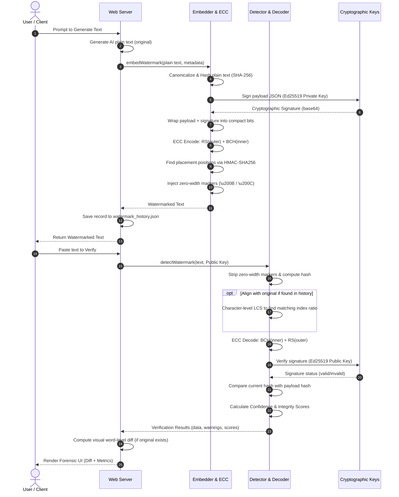

# Zerotrace: End-to-End Architecture & Verification Guide

This document describes the complete architecture of the **Zerotrace** watermarking and forensics platform. It outlines how text is watermarked (encoding/embedding) and how it is later authenticated and inspected for modifications (extraction/verification).

---

## 📖 Table of Contents
1. [Core Engine Flow Chart](#1-core-engine-flow-chart)
2. [Phase 1: Watermark Creation & Embedding](#2-phase-1-watermark-creation--embedding)
    - [Step A: Canonicalization & Document Hashing](#step-a-canonicalization--document-hashing)
    - [Step B: Payload Serialization & Cryptographic Signing](#step-b-payload-serialization--cryptographic-signing)
    - [Step C: Binary Bitstream Packing](#step-c-binary-bitstream-packing)
    - [Step D: Concatenated ECC Encoding (BCH + Reed-Solomon)](#step-d-concatenated-ecc-encoding-bch--reed-solomon)
    - [Step E: Keyed Pseudo-Random Placement](#step-e-keyed-pseudo-random-placement)
    - [Step F: Unicode Zero-Width Embedding](#step-f-unicode-zero-width-embedding)
3. [Phase 2: Watermark Extraction & Verification](#3-phase-2-watermark-extraction--verification)
    - [Step A: Text Cleaning & Hashing](#step-a-text-cleaning--hashing)
    - [Step B: Bit Extraction & LCS Alignment](#step-b-bit-extraction--lcs-alignment)
    - [Step C: Concatenated ECC Decoding & Telemetry](#step-c-concatenated-ecc-decoding--telemetry)
    - [Step D: Signature & Integrity Validation](#step-d-signature--integrity-validation)
4. [Phase 3: Visual Diffing (Tamper Analysis)](#4-phase-3-visual-diffing-tamper-analysis)
    - [History Retrieval (Jaccard Similarity)](#history-retrieval-jaccard-similarity)
    - [LCS Word Comparison](#lcs-word-comparison)
5. [🎛️ Scoring System & Telemetry Metrics](#5-scoring-system--telemetry-metrics)
6. [💡 Key Developer Rules (What to Remember)](#6-key-developer-rules-what-to-remember)

---

## 1. Core Engine Flow Chart



---

## 2. Phase 1: Watermark Creation & Embedding

The embedding pipeline is defined in [embedder.ts](file:///D:/pilabs/zerotrace/src/watermark/embedder.ts).

### Step A: Canonicalization & Document Hashing
To prevent whitespace adjustments or line ending variations from breaking the watermark connection:
1. The text is passed to [canonicalize.ts](file:///D:/pilabs/zerotrace/src/utils/canonicalize.ts).
2. It strips existing zero-width markers, normalizes line endings (`\r\n` $\rightarrow$ `\n`), collapses multiple spaces/tabs into a single space, limits consecutive newlines to two, and trims leading/trailing spaces.
3. The canonical text is hashed using **SHA-256** to compute `documentHash`.

### Step B: Payload Serialization & Cryptographic Signing
1. The system creates the `ProvenancePayload` containing version, provider, modelId, timestamp, nonce, and the computed `documentHash`.
2. This is serialized into a highly compressed JSON string (shortened keys: `v`, `p`, `m`, `t`, `n`, `h`) to keep the payload size small.
3. The serialized string is signed using the server's **Ed25519** private key ([signature.ts](file:///D:/pilabs/zerotrace/src/crypto/signature.ts)) generating a base64 signature.
4. The payload and signature are packaged together: `{"p": payloadString, "s": signatureString}`.

### Step C: Binary Bitstream Packing
The JSON wrapper string is converted to raw bits where each character's ASCII value is converted to a standard **8-bit binary representation**.

### Step D: Concatenated ECC Encoding (BCH + Reed-Solomon)
To make sure the watermark survives text modifications, the raw bits pass through a concatenated code:
```
raw bits ──> [ Reed-Solomon (outer) ] ──> [ BCH (inner) ] ──> ECC-protected bits
```
* **Reed-Solomon (Outer):** Operates on bytes. It is highly effective at correcting burst errors (e.g., when a user deletes a full sentence/word block).
* **BCH (Inner):** Operates on individual bits. It cleans up scattered bit flips (e.g., minor character swaps).

### Step E: Keyed Pseudo-Random Placement
Instead of sticking all bits in a row, they are spread across the text in a key-dependent pattern in [placement.ts](file:///D:/pilabs/zerotrace/src/watermark/placement.ts):
1. Locate all word boundaries (`\b`) in the text.
2. Initialize an HMAC-SHA256 generator using the `secretKey` and seed it with `documentHash + nonce`.
3. Generate pseudo-random numbers to select which word boundaries receive bits.
4. Sort the positions in descending order so that inserting characters starting from the end of the text does not shift the indices of preceding positions.

### Step F: Unicode Zero-Width Embedding
The bits are mapped to invisible characters ([unicode/index.ts](file:///D:/pilabs/zerotrace/src/unicode/index.ts)):
* `0` $\rightarrow$ `\u200B` (Zero Width Space)
* `1` $\rightarrow$ `\u200C` (Zero Width Non-Joiner)

These characters are injected at the computed placement positions.

---

## 3. Phase 2: Watermark Extraction & Verification

The extraction pipeline is defined in [detector/index.ts](file:///D:/pilabs/zerotrace/src/detector/index.ts).

### Step A: Text Cleaning & Hashing
The input text has its watermark characters removed to calculate `currentHash` (the SHA-256 hash of the cleaned text).

### Step B: Bit Extraction & LCS Alignment
* **Without Original Text:** The system scans the document in order, extracting `\u200B` as `0` and `\u200C` as `1`.
* **With Original Text (Alignment):** If the original text is found in history, a character-level **Longest Common Subsequence (LCS)** alignment is run between the original watermarked text and the checked text. This maps surviving zero-width characters to their original indices, providing a `matchRatio` (e.g. `0.95` means $95\%$ of original watermark characters survived).

### Step C: Concatenated ECC Decoding & Telemetry
The raw bits pass through the inverse ECC pipeline:
```
raw bits ──> [ BCH (inner) ] ──> [ Reed-Solomon (outer) ] ──> recovered JSON wrapper
```
Any repaired bits/bytes are logged (`bchBitsCorrected`, `rsBytesCorrected`). If the damage was too severe, it flags `uncorrectableBlocks`.

### Step D: Signature & Integrity Validation
1. The recovered JSON is parsed to extract the payload and signature.
2. The payload is verified using the **Ed25519 public key** to verify that it was signed by our server.
3. The `documentHash` stored inside the payload is compared against the `currentHash` computed in Step A. A mismatch means the text has been edited.

---

## 4. Phase 3: Visual Diffing (Tamper Analysis)

If the server recovers the watermark, it provides a visual diff of what was changed.

### History Retrieval (Jaccard Similarity)
If the database doesn't have an exact hash match, it performs a search on `watermark_history.json` using word-level **Jaccard Similarity**:
$$\text{Similarity} = \frac{|A \cap B|}{|A \cup B|}$$
Where $A$ is the set of unique words in the input text, and $B$ is the set of unique words in a history entry. If a candidate match is $\ge 0.3$ ($30\%$ overlap), it is selected as the original text source.

### LCS Word Comparison
Using a word-level Longest Common Subsequence (LCS) algorithm:
* **Inserted words** are wrapped in green `<ins>` tags.
* **Deleted words** are wrapped in red `<del>` tags with a strikethrough.

---

## 5. 🎛️ Scoring System & Telemetry Metrics

### Recovery Confidence
* **$100\%$ ($1.0$):** Watermark extracted + signature is verified.
* **$70\%$ ($0.7$):** Watermark extracted + signature is **invalid** (tampered metadata/spoofing).
* **$0\%$ ($0.0$):** No watermark detected.

### Integrity Score
* **Base:** Starts at **$100\%$** (if text hashes match) or **$50\%$** (if text hashes mismatch, indicating edits).
* **ECC Penalty:** Deducts **$5\%$** per corrected symbol. Caps at a max deduction of **$50\%$**.
* **Heavy Tampering Cap:** Hard caps the score at **$25\%$** if there are uncorrectable blocks.
* **Alignment Scaling:** Multiplied by the `matchRatio` (e.g. if $40\%$ of watermark characters were deleted, the score is multiplied by `0.6`).

---

## 💡 Key Developer Rules (What to Remember)

1. **One-Way Hashes:**
   The watermark payload does *not* contain the original text words. We cannot run a diff unless we can retrieve the original text via session memory (`lastGeneratedText`) or the database (`watermark_history.json`).
2. **Copy-Paste Resilience:**
   Copying and pasting preserves Unicode zero-width characters in most modern browsers and text editors, allowing verification to succeed. However, converting to basic plain-text formats (like ASCII/UTF-8 stripping) will wipe out the watermark.
3. **Canonicalization is Essential:**
   When calculating the hash, always canonicalize the text first so that minor changes (like swapping a carriage return `\r\n` for `\n` or adding trailing spaces) do not flag the document as modified.
4. **ECC Grading as Tamper Signals:**
   Do not treat ECC as just a silent correction tool. The amount of correction required (the telemetry) is a key signal for computing the Integrity Score.
