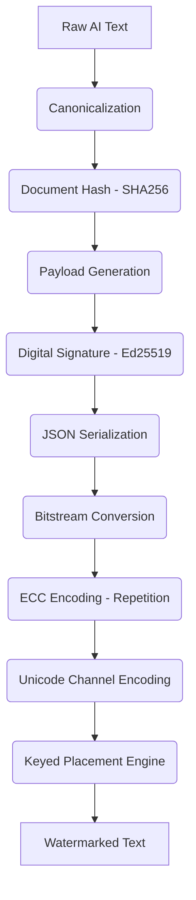
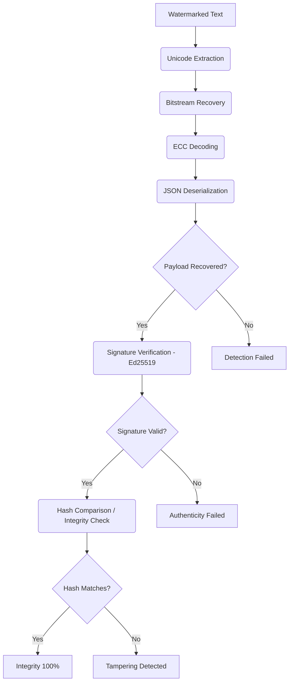

# ZeroTrace System Architecture

ZeroTrace is designed as a **post-generation, model-agnostic, cryptographically verifiable** watermarking framework. Instead of interfering with the AI model's generation process (like statistical token watermarking), ZeroTrace acts as a discrete layer that wraps the generated text in a cryptographic steganographic envelope.

Below is the detailed breakdown of what happens under the hood during the **Embed** and **Detect** phases.

---

## 1. The Embed Pipeline

When you run `zerotrace embed input.txt`, the system executes a multi-stage pipeline to securely attach provenance metadata to the text without altering its visible content.

### Step-by-Step Breakdown:
1. **Canonicalization**: The raw text is cleaned. Line endings are normalized to `\n`, multiple spaces are collapsed into single spaces, and any pre-existing zero-width characters are stripped. This ensures the text has a stable, predictable state.
2. **Document Hash**: The canonicalized text is hashed using SHA-256. This hash acts as a fingerprint for the exact semantic content of the document.
3. **Payload Generation**: A JSON object (the "Provenance Payload") is constructed containing metadata like the `provider`, `modelId`, a `nonce`, a `timestamp`, and the `documentHash`.
4. **Digital Signature**: The JSON payload is signed using the provider's Ed25519 Private Key. This guarantees that only the authorized provider could have generated this watermark.
5. **Bitstream Conversion**: The Payload + Signature are serialized into a JSON wrapper string, and every character is converted into an 8-bit binary string (e.g., `01100001`).
6. **ECC Encoding**: The binary string passes through Error Correction Codes (currently a 3x Repetition Code). For instance, a `1` becomes `111`. This ensures the watermark survives minor edits or character deletions.
7. **Unicode Channel Encoding**: The bits are mapped to invisible zero-width Unicode characters. 
   - `0` → `U+200B` (Zero Width Space)
   - `1` → `U+200C` (Zero Width Non-Joiner)
8. **Keyed Placement Engine**: Instead of dumping all invisible characters at the end of the file, an HMAC-SHA256 pseudo-random generator uses a Secret Key + the Document Hash to securely and deterministically distribute the characters across the text's word boundaries.
9. **Output**: The user receives the **Watermarked Text**—visually identical to the original, but containing a resilient, cryptographic signature.

---

## 2. The Detect Pipeline

When you run `zerotrace detect watermarked.txt`, the system acts as a forensic tool to extract, reconstruct, and verify the hidden data.

### Step-by-Step Breakdown:
1. **Unicode Extraction**: The system scans the entire document strictly looking for the designated Unicode channels (`U+200B` and `U+200C`).
2. **Bitstream Recovery**: The zero-width characters are mapped back to `0`s and `1`s, forming the raw, noisy bitstream.
3. **ECC Decoding**: The Error Correction Code processes the noisy bitstream, voting on bit chunks (e.g., `101` corrects to `1`) to repair any damage caused by word deletion or partial text copying.
4. **JSON Deserialization**: The repaired bitstream is converted back into UTF-8 text and parsed as a JSON object containing the payload and the signature.
5. **Signature Verification**: The Ed25519 Public Key evaluates the signature against the payload. If the signature is mathematically invalid, the system flags the text as an unverified forgery.
6. **Integrity Check**: The system strips the text of its watermark, re-runs Canonicalization, and computes a fresh SHA-256 hash. This new hash is compared against the `documentHash` stored inside the recovered payload.
7. **Output Report**: 
   - If the hashes match, the text is **100% authentic and untampered**. 
   - If the hashes differ, the system knows the text was generated by the AI but was later **edited/tampered** by a human.
   - The user is presented with the recovered metadata (`modelId`, `timestamp`, etc.), the confidence score, and any tamper warnings.
